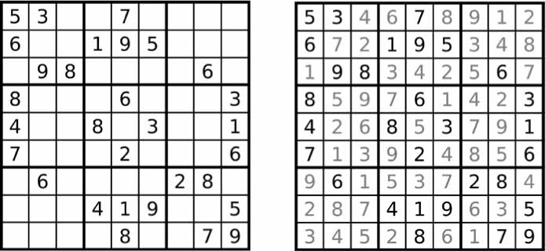

# Introdução

- [Introdução](#introdução)
  - [Para quem é este livro?](#para-quem-é-este-livro)
  - [Convenções](#convenções)
  - [O que é programação?](#o-que-é-programação)
    - [O que é Python?](#o-que-é-python)
    - [Programadores não precisam saber muita matemática](#programadores-não-precisam-saber-muita-matemática)
    - [Você não é velho demais para aprender programação](#você-não-é-velho-demais-para-aprender-programação)
    - [Programar é uma atividade criativa](#programar-é-uma-atividade-criativa)
  - [Sobre este livro](#sobre-este-livro)
  - [Baixando e instalando o Python](#baixando-e-instalando-o-python)
  - [Baixando e instalando o MU](#baixando-e-instalando-o-mu)
    - [Iniciando o Mu](#iniciando-o-mu)


"*Você acabou de fazer em duas horas o que três de nós levamos dois dias para fazer.*" Meu colega de quarto da faculdade estava trabalhando em uma loja de eletrônicos no início dos anos 2000. Ocasionalmente, a loja recebia uma planilha com milhares de preços de produtos de outras lojas. Uma equipe de três funcionários imprimia a planilha em uma pilha grossa de papel e a dividia entre si. Para cada preço de produto, eles procuravam o preço de sua loja e anotavam todos os produtos que seus concorrentes vendiam por menos. Geralmente levava alguns dias.

“*Sabe, eu poderia escrever um programa para fazer isso, se você tiver o arquivo original das impressões*", disse meu colega de quarto, quando os viu sentados no chão com papéis espalhados e empilhados ao redor.

Depois de algumas horas, ele mostrou um pequeno programa que leu o preço de um concorrente em um arquivo, encontrou o produto no banco de dados da loja e observou se o concorrente era mais barato. Ele ainda era novo em programação, por isso passava a maior parte do tempo pesquisando documentação em um livro de programação. O programa real levou apenas alguns segundos para ser executado. Meu colega de quarto e seus colegas de trabalho tiveram uma loga hora de almoço naquele dia.

Este é o poder da programação de computadores. Um computador é como um canivete suíço que você pode configurar para inúmeras tarefas. Muitas pessoas passam horas clicando e digitando para executar tarefas repetitivas, sem saber que a máquina que estão usando pode fazer seu trabalho em segundos, se derem as instruções corretas.

## Para quem é este livro?

O software está no centro de muitas das ferramentas que usamos hoje: quase todo mundo usa redes sociais para se comunicar, muitas pessoas têm computadores conectados à Internet em seus telefones e a maioria dos trabalhos de escritório envolve a interação com um computador para realizar o trabalho. Como resultado, a demanda por pessoas que podem codificar disparou. Inúmeros livros, tutoriais interativos na Web e campos de treinamento para desenvolvedores prometem transformar iniciantes ambiciosos em engenheiros de software com salários de seis dígitos.

Este livro não é para essas pessoas. É para todo mundo.

Por si só, este livro não o tornará um desenvolvedor de software profissional, assim como algumas aulas de guitarra o transformarão em uma estrela do rock. Mas se você trabalha em escritório, é administrador, acadêmico ou qualquer outra pessoa que usa um computador para trabalhar ou se divertir, aprenderá o básico da programação para poder automatizar tarefas simples como estas:

- Mover e renomear milhares de arquivos e classificá-los em pastas;
- Preencher formulários on-line - sem precisar digitar;
- Baixar arquivos ou copiar o texto de um site sempre que ele é atualizado;
- Receber mensagens de texto personalizadas do seu computador;
- Atualizar ou formatar planilhas do Excel;
- Verificar seu email e enviar respostas pré-escritas.

Essas tarefas são simples, mas os seres humanos gastam tempo fazendo-as, e geralmente são tão triviais ou específicas que não há software pronto para realizá-las. Armado com um pouco de conhecimento de programação, no entanto, você pode fazer com que seu computador execute essas tarefas por você.

## Convenções

Este livro não foi projetado como um manual de referência; é um guia para iniciantes. Às vezes, o estilo de codificação é contrário às práticas recomendadas (por exemplo, alguns programas usam variáveis ​​globais), mas isso é uma troca para tornar o código mais fácil de aprender. Este livro foi feito para que as pessoas escrevam códigos descartáveis, portanto, não há muito tempo gasto em estilo e elegância. Conceitos sofisticados de programação - como programação orientada a objetos, compreensão de lista e geradores - não são abordados devido à complexidade que eles adicionam. Programadores veteranos podem apontar maneiras pelas quais o código deste livro pode ser alterado para melhorar a eficiência, mas este livro se preocupa principalmente em fazer com que os programas funcionem com o mínimo de esforço de sua parte.

## O que é programação?

Programas de televisão e filmes geralmente mostram programadores furiosamente digitando fluxos enigmáticos de 1 e 0 em telas brilhantes, mas a programação moderna não é tão misteriosa. A *programação* é simplesmente o ato de inserir instruções para o computador executar. Essas instruções podem processar alguns números, modificar texto, procurar informações em arquivos ou se comunicar com outros computadores pela Internet.

Todos os programas usam instruções básicas como blocos de construção. Aqui estão alguns dos mais comuns, em inglês:

- “Do this; then do that.”
- “If this condition is true, perform this action; otherwise, do that action.”
- “Do this action exactly 27 times.”
- “Keep doing that until this condition is true.”

Você pode combinar esses componentes para implementar decisões mais complexas também. Por exemplo, aqui estão as instruções de programação, chamadas de código fonte, para um programa simples escrito na linguagem de programação Python. Começando no topo, o software Python executa cada linha de código (algumas linhas são executadas apenas se uma determinada condição for verdadeira ou o Python executa outra linha) até chegar ao fundo.

    ➊ passwordFile = open('SecretPasswordFile.txt')
    ➋ secretPassword = passwordFile.read()
    ➌ print('Enter your password.')
      typedPassword = input()
    ➍ if typedPassword == secretPassword:
        ➎ print('Access granted')
        ➏ if typedPassword == '12345':
            ➐ print('That password is one that an idiot puts on their luggage.')
        else:
            ➑ print('Access denied')

Você pode não saber nada sobre programação, mas provavelmente pode adivinhar o que o código anterior faz apenas lendo-o. Primeiro, o arquivo SecretPasswordFile.txt é aberto ➊, e a senha secreta nele é lida ➋. Em seguida, o usuário é solicitado a inserir uma senha (a partir do teclado) ➌. Essas duas senhas são comparadas "e, se forem iguais, o programa imprimirá o acesso concedido à tela". Em seguida, o programa verifica se a senha é 12345 ➏ e sugere que essa opção pode não ser a melhor para uma senha ➐. Se as senhas não forem iguais, o programa imprime Acesso negado na tela ➑.

### O que é Python?

*Python* é uma linguagem de programação (com regras de sintaxe para escrever o que é considerado código Python válido) e o software interpretador Python que lê o código-fonte (escrito na linguagem Python) e executa suas instruções. Você pode fazer o download do interpretador Python gratuitamente em <https://python.org/> e existem versões para Linux, macOS e Windows.

O nome Python vem do surreal grupo de comédia britânico Monty Python, não da cobra. Os programadores de Python são carinhosamente chamados de Pythonistas, e as referências de Monty Python e serpentina geralmente apimentam os tutoriais e a documentação de Python.

### Programadores não precisam saber muita matemática

A ansiedade mais comum que ouço sobre aprender a programar é a noção de que isso requer muita matemática. Na verdade, a maioria dos programas não requer matemática além da aritmética básica. De fato, ser bom em programação não é diferente de ser bom em resolver quebra-cabeças de Sudoku.

Para resolver um quebra-cabeça de Sudoku, os números de 1 a 9 devem ser preenchidos para cada linha, cada coluna e cada quadrado interno 3 × 3 do quadro 9 × 9 completo. Alguns números são fornecidos para você começar e você encontra uma solução fazendo deduções com base nesses números. No quebra-cabeça mostrado na Figura 0-1, como 5 aparece na primeira e na segunda linhas, ele não pode aparecer nessas linhas novamente. Portanto, na grade superior direita, ele deve estar na terceira linha. Como a última coluna também já possui um 5, os 5 não podem ir para a direita dos 6, portanto, devem ir para a esquerda dos 6. A resolução de uma linha, coluna ou quadrado fornecerá mais pistas para o restante o quebra-cabeça e, ao preencher um grupo de números de 1 a 9 e depois outro, em breve você resolverá toda a grade.

  
*Figure 0-1: A new Sudoku puzzle (left) and its solution (right). Despite using numbers, Sudoku doesn’t involve much math. (Images © Wikimedia Commons)*

Só porque o Sudoku envolve números não significa que você precisa ser bom em matemática para descobrir a solução. O mesmo se aplica à programação. Como resolver um quebra-cabeça de Sudoku, escrever programas envolve dividir um problema em etapas individuais e detalhadas. Da mesma forma, ao *depurar* programas (ou seja, localizar e corrigir erros), você observa pacientemente o que o programa está fazendo e encontra a causa dos erros. E, como todas as habilidades, quanto mais você programa, melhor se tornará.

### Você não é velho demais para aprender programação

A segunda ansiedade mais comum que ouço sobre aprender a programar é que as pessoas pensam que são velhas demais para aprender. Eu li muitos comentários na Internet de pessoas que acham que é tarde demais para eles, porque eles já têm (ofegam!) 23 anos. Claramente, isso não é "velho demais" para aprender a programar: muitas pessoas aprendem muito mais tarde na vida.

Você não precisa ter começado quando criança para se tornar um programador capaz. Mas a imagem dos programadores como crianças gêmeas é persistente. Infelizmente, contribuo para esse mito quando digo aos outros que estava na escola primária quando comecei a programar.

No entanto, a programação é muito mais fácil de aprender hoje do que nos anos 90. Hoje, existem mais livros, melhores mecanismos de pesquisa e muitos outros sites de perguntas e respostas on-line. Além disso, as próprias linguagens de programação são muito mais fáceis de usar. Por esses motivos, **tudo o que aprendi sobre programação entre o ensino fundamental e o ensino médio pode ser aprendido hoje em poucos fins de semana**. Minha vantagem nem foi tão grande assim.

É importante ter uma "mentalidade de crescimento" sobre programação - em outras palavras, entender que as pessoas desenvolvem habilidades de programação através da prática. Eles não nasceram como programadores, e não ser qualificado em programação agora não é uma indicação de que você nunca pode se tornar um especialista.

### Programar é uma atividade criativa

Programar é uma tarefa criativa, como pintar, escrever, tricotar ou construir castelos LEGO. Como pintar uma tela em branco, a criação de software tem muitas restrições, mas infinitas possibilidades.

A diferença entre programação e outras atividades criativas é que, ao programar, você tem todas as matérias-primas necessárias em seu computador; você não precisa comprar telas, tintas, filmes, fios, tijolos LEGO ou componentes eletrônicos adicionais. Um computador de uma década é mais do que poderoso o suficiente para escrever programas. Depois que seu programa é gravado, ele pode ser copiado perfeitamente um número infinito de vezes. Um suéter de malha só pode ser usado por uma pessoa de cada vez, mas um programa útil pode ser facilmente compartilhado on-line com o mundo inteiro.

## Sobre este livro

A primeira parte deste livro aborda os conceitos básicos de programação Python e a segunda parte abrange várias tarefas que você pode automatizar o computador. Cada capítulo da segunda parte possui programas de projeto para você estudar. Aqui está um breve resumo do que você encontrará em cada capítulo.

>**Parte I: Noções básicas de programação em Python**
>>**Capítulo 1**: **Informações básicas** sobre o Python Abrange expressões, o tipo mais básico de instrução em Python e como usar o software de shell interativo Python para experimentar o código.
>>
>>**Capítulo 2**: **Controle de fluxo** Explica como fazer com que os programas decidam quais instruções executar, para que seu código possa responder de forma inteligente a diferentes condições.
>>
>>**Capítulo 3**: **Funções** Instrui você sobre como definir suas próprias funções para que você possa organizar seu código em blocos mais gerenciáveis.
>>
>>**Capítulo 4**: **Listas** Apresenta o tipo de dados da lista e explica como organizar os dados.
>>
>>**Capítulo 5**: **Dicionários e estruturação de dados** Apresenta o tipo de dados do dicionário e mostra maneiras mais poderosas de organizar dados.
>>
>>**Capítulo 6**: **Manipulando strings** Cobre o trabalho com dados de texto (chamados strings em Python).

>**Parte II**: **Automatizando tarefas**
>>**Capítulo 7**: **Correspondência de padrões com expressões regulares** Cobre como o Python pode manipular sequências de caracteres e procurar padrões de texto com expressões regulares.
>>
>>**Capítulo 8**: **Validação de entrada** Explica como seu programa pode verificar as informações que um usuário fornece, garantindo que os dados do usuário cheguem em um formato que não cause erros no restante do programa.
>>
>>**Capítulo 9**: **Leitura e gravação de arquivos** Explica como seu programa pode ler o conteúdo de arquivos de texto e salvar informações em arquivos no disco rígido.
>>
>>**Capítulo 10**: **Organização de arquivos** Mostra como o Python pode copiar, mover, renomear e excluir um grande número de arquivos muito mais rapidamente do que um usuário humano. Também explica a compactação e descompactação de arquivos.
>>
>>**Capítulo 11**: **Depuração** Mostra como usar as várias ferramentas de detecção e correção de erros do Python.
>>
>>**Capítulo 12**: **Varredura na Web** Mostra como escrever programas que podem baixar automaticamente páginas da Web e analisá-las para obter informações. Isso é chamado de varredura da web.
>>
>>**Capítulo 13**: **Trabalhando com planilhas do Excel** Demonstra como manipular programaticamente as planilhas do Excel para que você não precise lê-las. Isso é útil quando o número de documentos que você precisa analisar é de centenas ou milhares.
>>
>>**Capítulo 14**: **Trabalhando com o Google Sheets** Abrange como ler e atualizar o Google Sheets, um popular aplicativo de planilha baseado na Web, usando Python.
>>
>>**Capítulo 15**: **Trabalhando com documentos PDF e Word** Cobre programaticamente a leitura de documentos Word e PDF.
>>
>>**Capítulo 16**: **Trabalhando com arquivos CSV e dados JSON** Continua a explicar como manipular programaticamente documentos, agora discutindo arquivos CSV e JSON.
>>
>>**Capítulo 17**: **Mantendo a hora, agendando tarefas e iniciando programas** Explica como os programas Python lidam com a hora e as datas e como agendar seu computador para executar tarefas em determinados horários. Também mostra como seus programas Python podem iniciar programas não-Python.
>>
>>**Capítulo 18**: **Enviando email e mensagens de texto** Explica como escrever programas que podem enviar emails e mensagens de texto em seu nome.
>>
>>**Capítulo 19**: **Manipulando imagens** Explica como manipular programaticamente imagens como arquivos JPEG ou PNG.
>>
>>**Capítulo 20**: **Controlando o teclado e o mouse com automação da GUI** Explica como controlar programaticamente o mouse e o teclado para automatizar cliques e pressionamentos de teclas.
>>
>>**Apêndice A**: **Instalação de módulos de terceiros** Mostra como estender o Python com módulos adicionais úteis.
>>
>>**Apêndice B**: **Executando programas** Mostra como executar seus programas Python no Windows, macOS e Linux de fora do editor de código.
>>
>>**Apêndice C**: **Respostas às questões práticas** Fornece respostas e algum contexto adicional para as questões práticas no final de cada capítulo.

## Baixando e instalando o Python

Você pode baixar o Python para Windows, macOS e Ubuntu gratuitamente em <https://python.org/downloads/>. Se você baixar a versão mais recente da página de download do site, todos os programas deste livro deverão funcionar.

>**ATENÇÃO**
>>Certifique-se de baixar uma versão do Python 3 (como 3.8.0). Os programas deste livro foram escritos para execução no Python 3 e podem não ser executados corretamente, se houver, no Python 2.

Na página de download, você encontrará instaladores Python para computadores de 64 e 32 bits para cada sistema operacional, portanto, primeiro descubra qual instalador você precisa. Se você comprou seu computador em 2007 ou mais tarde, provavelmente é um sistema de 64 bits. Caso contrário, você tem uma versão de 32 bits, mas aqui está como descobrir com certeza:

- No Windows, selecione **Iniciar** ▸ **Painel de controle** ▸ **Sistema** e verifique se Tipo de sistema indica 64 ou 32 bits.
- No macOS, vá ao menu Apple, selecione **Sobre este Mac** ▸ **Mais informações** ▸ **Relatório do sistema** ▸ **Hardware** e, em seguida, observe o campo Nome do processador. Se estiver escrito Intel Core Solo ou Intel Core Duo, você possui uma máquina de 32 bits. Se diz mais alguma coisa (incluindo o Intel Core 2 Duo), você tem uma máquina de 64 bits.
- No Ubuntu Linux, abra um Terminal e execute o comando ```uname -m```. Uma resposta do i686 significa 32 bits e x86_64 significa 64 bits.

No Windows, baixe o instalador do *Python* (o nome do arquivo terminará em *.msi*) e clique duas vezes nele. Siga as instruções que o instalador exibe na tela para instalar o *Python*, conforme listado aqui:

1. Selecione **Instalar para todos os usuários** e clique em **Avançar**.
1. Aceite as opções padrão para as próximas janelas clicando em **Avançar**.

No macOS, faça o download do arquivo *.dmg* adequado para sua versão do macOS e clique duas vezes nele. Siga as instruções que o instalador exibe na tela para instalar o Python, conforme listado aqui:

1. Quando o pacote DMG abrir em uma nova janela, clique duas vezes no arquivo *Python.mpkg*. Pode ser necessário digitar a senha do administrador.
2. Aceite as opções padrão para as próximas janelas clicando em **Continuar** e clique em **Concordo** para aceitar a licença.
3. Na janela final, clique em **Instalar**.

Se você estiver executando o Ubuntu, poderá instalar o Python a partir do Terminal, seguindo estas etapas:

1. Abra a janela do terminal.
2. Digite ```sudo apt-get install python3```.
3. Digite ```sudo apt-get install idle3```.
4. Digite ```sudo apt-get install python3-pip```.

## Baixando e instalando o MU

Enquanto o *interpretador Python* é o software que executa seus programas Python, o *software de edição Mu* é onde você insere seus programas, da mesma maneira que digita em um processador de texto. Você pode baixar o Mu em *<https://codewith.mu/>*.

No Windows e no macOS, baixe o instalador do seu sistema operacional e execute-o clicando duas vezes no arquivo do instalador. Se você estiver no macOS, a execução do instalador abre uma janela onde você deve arrastar o ícone Mu para o ícone da pasta Aplicativos para continuar a instalação. Se você estiver no Ubuntu, precisará instalar o Mu como um pacote Python. Nesse caso, clique no botão Instruções na seção Pacote Python da página de download.

### Iniciando o Mu

Depois de instalado, vamos iniciar o Mu:

- No Windows 7 ou posterior, clique no ícone Iniciar no canto inferior esquerdo da tela, digite **Mu** na caixa de pesquisa e selecione-o.
- No macOS, abra a janela do Finder, clique em **Aplicativos** e, em seguida, clique em **mu-editor**.
- No Ubuntu, selecione **Aplicativos** ▸ **Acessórios** ▸ **Terminal** e digite ```python3 –m mu```.

Na primeira vez que o Mu é executado, a janela *Select Mode* será exibida com as opções *Adafruit CircuitPython*, *BBC micro: bit*, *Pygame Zero* e *Python 3*. Selecione **Python 3**. Você sempre pode alterar o modo posteriormente clicando no botão *Mode* na parte superior do janela do editor.
