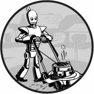

- [Introdução](#introdução)
  - [Para quem é este livro?](#para-quem-é-este-livro)
  - [Convenções](#convenções)
  - [O que é programação?](#o-que-é-programação)
    - [O que é Python?](#o-que-é-python)
    - [Programadores não precisam saber muita matemática](#programadores-não-precisam-saber-muita-matemática)

# Introdução

"*Você acabou de fazer em duas horas o que três de nós levamos dois dias para fazer.*" Meu colega de quarto da faculdade estava trabalhando em uma loja de eletrônicos no início dos anos 2000. Ocasionalmente, a loja recebia uma planilha com milhares de preços de produtos de outras lojas. Uma equipe de três funcionários imprimia a planilha em uma pilha grossa de papel e a dividia entre si. Para cada preço de produto, eles procuravam o preço de sua loja e anotavam todos os produtos que seus concorrentes vendiam por menos. Geralmente levava alguns dias.

“*Sabe, eu poderia escrever um programa para fazer isso, se você tiver o arquivo original das impressões*", disse meu colega de quarto, quando os viu sentados no chão com papéis espalhados e empilhados ao redor.

Depois de algumas horas, ele mostrou um pequeno programa que leu o preço de um concorrente em um arquivo, encontrou o produto no banco de dados da loja e observou se o concorrente era mais barato. Ele ainda era novo em programação, por isso passava a maior parte do tempo pesquisando documentação em um livro de programação. O programa real levou apenas alguns segundos para ser executado. Meu colega de quarto e seus colegas de trabalho tiveram uma loga hora de almoço naquele dia.

Este é o poder da programação de computadores. Um computador é como um canivete suíço que você pode configurar para inúmeras tarefas. Muitas pessoas passam horas clicando e digitando para executar tarefas repetitivas, sem saber que a máquina que estão usando pode fazer seu trabalho em segundos, se derem as instruções corretas.

## Para quem é este livro?

O software está no centro de muitas das ferramentas que usamos hoje: quase todo mundo usa redes sociais para se comunicar, muitas pessoas têm computadores conectados à Internet em seus telefones e a maioria dos trabalhos de escritório envolve a interação com um computador para realizar o trabalho. Como resultado, a demanda por pessoas que podem codificar disparou. Inúmeros livros, tutoriais interativos na Web e campos de treinamento para desenvolvedores prometem transformar iniciantes ambiciosos em engenheiros de software com salários de seis dígitos.

Este livro não é para essas pessoas. É para todo mundo.

Por si só, este livro não o tornará um desenvolvedor de software profissional, assim como algumas aulas de guitarra o transformarão em uma estrela do rock. Mas se você trabalha em escritório, é administrador, acadêmico ou qualquer outra pessoa que usa um computador para trabalhar ou se divertir, aprenderá o básico da programação para poder automatizar tarefas simples como estas:

* Mover e renomear milhares de arquivos e classificá-los em pastas;
* Preencher formulários on-line - sem precisar digitar;
* Baixar arquivos ou copiar o texto de um site sempre que ele é atualizado;
* Receber mensagens de texto personalizadas do seu computador;
* Atualizar ou formatar planilhas do Excel;
* Verificar seu email e enviar respostas pré-escritas.

Essas tarefas são simples, mas os seres humanos gastam tempo fazendo-as, e geralmente são tão triviais ou específicas que não há software pronto para realizá-las. Armado com um pouco de conhecimento de programação, no entanto, você pode fazer com que seu computador execute essas tarefas por você.

## Convenções

Este livro não foi projetado como um manual de referência; é um guia para iniciantes. Às vezes, o estilo de codificação é contrário às práticas recomendadas (por exemplo, alguns programas usam variáveis ​​globais), mas isso é uma troca para tornar o código mais fácil de aprender. Este livro foi feito para que as pessoas escrevam códigos descartáveis, portanto, não há muito tempo gasto em estilo e elegância. Conceitos sofisticados de programação - como programação orientada a objetos, compreensão de lista e geradores - não são abordados devido à complexidade que eles adicionam. Programadores veteranos podem apontar maneiras pelas quais o código deste livro pode ser alterado para melhorar a eficiência, mas este livro se preocupa principalmente em fazer com que os programas funcionem com o mínimo de esforço de sua parte.

## O que é programação?

Programas de televisão e filmes geralmente mostram programadores furiosamente digitando fluxos enigmáticos de 1 e 0 em telas brilhantes, mas a programação moderna não é tão misteriosa. A *programação* é simplesmente o ato de inserir instruções para o computador executar. Essas instruções podem processar alguns números, modificar texto, procurar informações em arquivos ou se comunicar com outros computadores pela Internet.

Todos os programas usam instruções básicas como blocos de construção. Aqui estão alguns dos mais comuns, em inglês:

* “Do this; then do that.”
* “If this condition is true, perform this action; otherwise, do that action.”
* “Do this action exactly 27 times.”
* “Keep doing that until this condition is true.”

Você pode combinar esses componentes para implementar decisões mais complexas também. Por exemplo, aqui estão as instruções de programação, chamadas de código fonte, para um programa simples escrito na linguagem de programação Python. Começando no topo, o software Python executa cada linha de código (algumas linhas são executadas apenas se uma determinada condição for verdadeira ou o Python executa outra linha) até chegar ao fundo.

    ➊ passwordFile = open('SecretPasswordFile.txt')
    ➋ secretPassword = passwordFile.read()
    ➌ print('Enter your password.')
      typedPassword = input()
    ➍ if typedPassword == secretPassword:
        ➎ print('Access granted')
        ➏ if typedPassword == '12345':
            ➐ print('That password is one that an idiot puts on their luggage.')
        else:
            ➑ print('Access denied')

Você pode não saber nada sobre programação, mas provavelmente pode adivinhar o que o código anterior faz apenas lendo-o. Primeiro, o arquivo SecretPasswordFile.txt é aberto ➊, e a senha secreta nele é lida ➋. Em seguida, o usuário é solicitado a inserir uma senha (a partir do teclado) ➌. Essas duas senhas são comparadas "e, se forem iguais, o programa imprimirá o acesso concedido à tela". Em seguida, o programa verifica se a senha é 12345 ➏ e sugere que essa opção pode não ser a melhor para uma senha ➐. Se as senhas não forem iguais, o programa imprime Acesso negado na tela ➑.

### O que é Python?

*Python* é uma linguagem de programação (com regras de sintaxe para escrever o que é considerado código Python válido) e o software interpretador Python que lê o código-fonte (escrito na linguagem Python) e executa suas instruções. Você pode fazer o download do interpretador Python gratuitamente em https://python.org/ e existem versões para Linux, macOS e Windows.

O nome Python vem do surreal grupo de comédia britânico Monty Python, não da cobra. Os programadores de Python são carinhosamente chamados de Pythonistas, e as referências de Monty Python e serpentina geralmente apimentam os tutoriais e a documentação de Python.

### Programadores não precisam saber muita matemática

A ansiedade mais comum que ouço sobre aprender a programar é a noção de que isso requer muita matemática. Na verdade, a maioria dos programas não requer matemática além da aritmética básica. De fato, ser bom em programação não é diferente de ser bom em resolver quebra-cabeças de Sudoku.

Para resolver um quebra-cabeça de Sudoku, os números de 1 a 9 devem ser preenchidos para cada linha, cada coluna e cada quadrado interno 3 × 3 do quadro 9 × 9 completo. Alguns números são fornecidos para você começar e você encontra uma solução fazendo deduções com base nesses números. No quebra-cabeça mostrado na Figura 0-1, como 5 aparece na primeira e na segunda linhas, ele não pode aparecer nessas linhas novamente. Portanto, na grade superior direita, ele deve estar na terceira linha. Como a última coluna também já possui um 5, os 5 não podem ir para a direita dos 6, portanto, devem ir para a esquerda dos 6. A resolução de uma linha, coluna ou quadrado fornecerá mais pistas para o restante o quebra-cabeça e, ao preencher um grupo de números de 1 a 9 e depois outro, em breve você resolverá toda a grade.

  
*Figure 0-1: A new Sudoku puzzle (left) and its solution (right). Despite using numbers, Sudoku doesn’t involve much math. (Images © Wikimedia Commons)*

