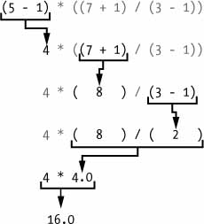
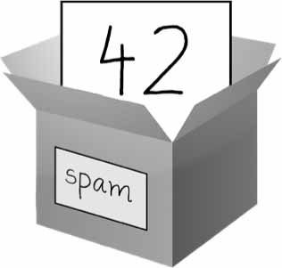
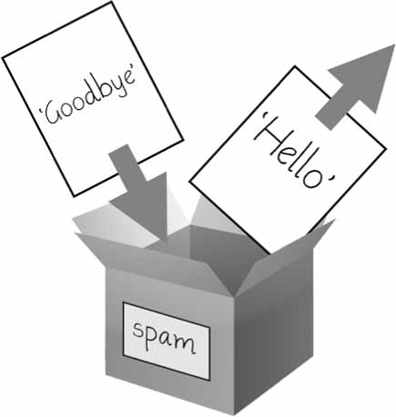

# Fundamentos de Python

- [Fundamentos de Python](#fundamentos-de-python)
  - [Inserindo expressões no shell interativo](#inserindo-expressões-no-shell-interativo)
  - [Os tipos de dados Inteiro, Ponto flutuante e String](#os-tipos-de-dados-inteiro-ponto-flutuante-e-string)
  - [Concatenação e replicação de strings](#concatenação-e-replicação-de-strings)
  - [Armazenando valores em variáveis](#armazenando-valores-em-variáveis)
    - [Declarações de atribuição](#declarações-de-atribuição)
    - [Nomes de Variáveis](#nomes-de-variáveis)
  - [Seu primeiro programa](#seu-primeiro-programa)


A linguagem de programação Python possui uma ampla variedade de construções sintáticas, funções padrão da biblioteca e recursos do ambiente de desenvolvimento interativo. Felizmente, você pode ignorar a maior parte disso; você só precisa aprender o suficiente para escrever alguns programas úteis.

Você terá, no entanto, que aprender alguns conceitos básicos de programação antes de poder fazer qualquer coisa. Como um assistente em treinamento, você pode pensar que esses conceitos parecem misteriosos e tediosos, mas com algum conhecimento e prática, você poderá comandar seu computador como uma varinha mágica e realizar feitos incríveis.

Este capítulo tem alguns exemplos que o incentivam a digitar no *shell interativo*, também chamado de *REPL* (*Read-Evaluate-Print Loop*), que permite rodar (ou *executar*) instruções Python, uma de cada vez, e mostra instantaneamente os resultados. O uso do shell interativo é ótimo para aprender o que as instruções básicas do Python fazem, então experimente enquanto você o acompanha. Você se lembrará muito mais das coisas que faz do que das que apenas lê.

## Inserindo expressões no shell interativo

Você pode executar o shell interativo iniciando o editor Mu, que você deve ter baixado ao seguir as instruções de configuração no Prefácio. No Windows, abra o menu Iniciar, digite "Mu" e abra o aplicativo Mu. No macOS, abra a pasta Aplicativos e clique duas vezes em **Mu**. Clique no botão **Novo** e salve um arquivo vazio como *blank.py*. Quando você executar esse arquivo vazio, clicando no botão **Executar** ou pressionando ```F5```, ele abre o shell interativo, que será aberto como um novo painel que se abre na parte inferior da janela do editor de Mu. Você deve ver um prompt *>>>* no shell interativo.

```pycon
>>> 2 + 2
4
>>>
```

No Python, ```2 + 2``` é chamado de *expressão*, que é o tipo mais básico de instrução de programação na linguagem. Expressões consistem em valores (como 2) e operadores (como +) e sempre podem avaliar (ou seja, reduzir) até um único valor. Isso significa que você pode usar expressões em qualquer lugar do código Python que também possa usar um valor.

No exemplo anterior, ```2 + 2``` é avaliado em um único valor, 4. Um valor único sem operadores também é considerado uma expressão, embora seja avaliado apenas para si mesmo, conforme mostrado aqui:

```pycon
>>> 2
2
```

>**TUDO BEM HAVER ERROS!**
>Os programas travam se contiverem código que o computador não entende, o que fará com que o Python mostre uma mensagem de erro. Uma mensagem de erro não interromperá o computador, portanto, não tenha medo de cometer erros. Uma *falha* significa que o programa parou de funcionar inesperadamente.
>Se você quiser saber mais sobre um erro, procure o texto exato da mensagem de erro online para obter mais informações. Você também pode conferir os recursos em *<https://nostarch.com/automatestuff2/>* para ver uma lista de mensagens de erro comuns do Python e seus significados.

Você também pode usar muitos outros operadores nas expressões Python. Por exemplo, a Tabela 1-1 lista todos os operadores matemáticos no Python.

Tabela 1-1: Operadores matemáticos da maior para a menor precedência  
| Operador | Operação | Exemplo | Avalia como. . . |
| :---: | :---: | :---: | :---: |
| \*\* | Expoente | 2 \*\* 3 | 8 |
| % | Módulo / restante | 22 % 8 | 6 |
| // | Divisão inteira / quociente com piso | 22 // 8 | 2 |
| / | Divisão | 22/8 | 2.75 |
| \* | Multiplicação | 3 \* 5 | 15 |
| - | Subtração | 5 - 2 | 3 |
| + | Adição | 2 + 2 | 4 |

A *ordem das operações* (também chamada *precedência*) dos operadores matemáticos do Python é semelhante à da matemática. O operador ```**``` é avaliado primeiro; os operadores ```*```, ```/```, ```//``` e ```%``` são avaliados a seguir, da esquerda para a direita; e os operadores ```+``` e ```-``` são avaliados por último (também da esquerda para a direita). Você pode usar parênteses para substituir a precedência usual, se necessário. O espaço em branco entre os operadores e os valores não importa para o Python (exceto o recuo no início da linha), mas um único espaço é uma convenção. Digite as seguintes expressões no shell interativo:

```pycon
>>> 2 + 3 * 6
20
>>> (2 + 3) * 6
30
>>> 48565878 * 578453
28093077826734
>>> 2 ** 8
256
>>> 23 / 7
3.2857142857142856
>>> 23 // 7
3
>>> 23 % 7
2
>>> 2      +           2
4
>>> (5 - 1) * ((7 + 1) / (3 - 1))
16.0
```

Em cada caso, você como programador deve inserir a expressão, mas o Python faz a parte mais difícil de avaliá-la em um único valor. O Python continuará avaliando partes da expressão até que ela se torne um valor único, como mostrado aqui:



Essas regras para reunir operadores e valores para formar expressões são uma parte fundamental do Python como linguagem de programação, assim como as regras gramaticais que nos ajudam a nos comunicar. Aqui está um exemplo:

- **Esta é uma frase em português gramaticalmente correta.**

- **Isto é gramaticalmente, não está em português correto a.**

A segunda linha é difícil de analisar porque não segue as regras do português. Da mesma forma, se você digitar uma instrução Python incorreta, o Python não será capaz de entendê-la e exibirá uma mensagem de erro ```SyntaxError```, conforme mostrado aqui:

```pycon
>>> 5 +
  File "<stdin>", line 1
    5 +
      ^
SyntaxError: invalid syntax
>>> 42 + 5 + * 2
  File "<stdin>", line 1
    42 + 5 + * 2
             ^
SyntaxError: invalid syntax
```

Você sempre pode testar para ver se uma instrução funciona inserindo-a no shell interativo. Não se preocupe em quebrar o computador: o pior que pode acontecer é que o Python responda com uma mensagem de erro. Desenvolvedores de software profissionais sempre recebem mensagens de erro enquanto escrevem código.

## Os tipos de dados Inteiro, Ponto flutuante e String

Lembre-se de que expressões são apenas valores combinados com operadores e sempre são avaliadas em um único valor. Um *tipo de dados* é uma categoria para valores e todo valor pertence a exatamente um tipo de dados. Os tipos de dados mais comuns no Python estão listados na Tabela 1-2. Os valores -2 e 30 , por exemplo, são considerados valores *inteiros*. O tipo de dados inteiro (ou *int*) indica valores que são números inteiros. Os números com um ponto decimal (como *3.14*) são chamados de *números de ponto flutuante* (ou *floats*). Observe que, embora o valor 42 seja um número inteiro, o valor 42.0 seria um número de ponto flutuante.

**Tabela 1-2**: *Tipos de dados comuns*
| Tipo de dados | Exemplos |
| :---: | :---: |
| Inteiros|-2 , -1 , 0 , 1 , 2 , 3 , 4 , 5|
| Números de ponto flutuante | -1.25, -1.0, -0.5, 0.0, 0.5, 1.0, 1.25 |
| Cordas | 'a' , 'aa' , 'aaa' , 'Olá!' , '11 gatos ' |

Os programas Python também podem ter valores de texto chamados *strings*, ou *strs* (pronuncia-se "stirs"). Sempre coloque sua string entre caracteres de aspas simples (') (como em 'Hello' ou 'Goodbye cruel world!'), Para que o Python saiba onde a string começa e termina. Você pode até ter uma string sem caracteres '' , chamada *string em branco* ou *string vazia*. As strings são explicadas em mais detalhes no Capítulo 4.

Se você vir a mensagem de erro ```SyntaxError: EOL while scanning string literal```, provavelmente esqueceu o caractere de aspas simples no final da string, como neste exemplo:

```pycon
>>> 'Olá, mundo!
SyntaxError: EOL while scanning string literal
```

## Concatenação e replicação de strings

O significado de um operador pode mudar com base nos tipos de dados dos valores próximos a ele. Por exemplo, + é o operador de adição quando opera em dois números inteiros ou em valores de ponto flutuante. No entanto, quando + é usado em dois valores de cadeia, ele une as cadeias como o operador de *concatenação de cadeias*. Digite o seguinte no shell interativo:

```pycon
>>> 'Alice' + 'Bob'
'AliceBob'
```

A expressão é avaliada em uma única e nova string cujo valor é a combinação do texto das duas iniciais. No entanto, se você tentar usar o operador + em uma string e um valor inteiro, o Python não saberá como lidar com isso e exibirá uma mensagem de erro.

```pycon
>>> 'Alice' + 42
Traceback (most recent call last):
  File "<pyshell#0>", line 1, in <module>
    'Alice' + 42
TypeError: can only concatenate str (not "int") to str
```

A mensagem de erro ```can only concatenate str (not "int") to str``` significa que o Python pensou que você estava tentando concatenar um número inteiro para a string ```'Alice'```. Seu código precisará converter explicitamente o número inteiro em uma string, porque o Python não pode fazer isso automaticamente. (A conversão de tipos de dados será explicada em “ Dissecando o seu programa ” na página 13 quando falamos sobre as funções ```str()```, ```int()``` e ```float()```).

O operador \* multiplica dois valores inteiros ou de ponto flutuante. Mas quando o operador \* é usado em um valor de string e um valor inteiro, ele se torna o operador de *replicação de string*. Digite uma sequência multiplicada por um número no shell interativo para ver isso em ação.

```pycon
>>> 'Alice' * 5
'AliceAliceAliceAliceAlice'
```

A expressão é avaliada em uma única string que repete a string original um número de vezes igual ao valor inteiro. A replicação de string é um truque útil, mas não é usada com tanta frequência como concatenação de cadeias.

O operador \* pode ser usado com apenas dois valores numéricos (para multiplicação) ou um valor de string e um valor inteiro (para replicação de string). Caso contrário, o Python exibirá apenas uma mensagem de erro, como a seguinte:

```pycon
>>> 'Alice' * 'Bob'
Traceback (most recent call last):
  File "<pyshell#32>", line 1, in <module>
    'Alice' * 'Bob'
TypeError: can't multiply sequence by non-int of type 'str'
>>> 'Alice' * 5.0
Traceback (most recent call last):
  File "<pyshell#33>", line 1, in <module>
    'Alice' * 5.0
TypeError: can't multiply sequence by non-int of type 'float'
```

Faz sentido que o Python não entenda essas expressões: você não pode multiplicar duas palavras e é difícil replicar uma string arbitrária um número fracionário de vezes.

## Armazenando valores em variáveis

Uma *variável* é como uma caixa na memória do computador onde você pode armazenar um único valor. Se você deseja usar o resultado de uma expressão avaliada posteriormente em seu programa, salve-a dentro de uma variável.

### Declarações de atribuição

Você armazenará valores em variáveis ​​com uma *declaração de atribuição*. Uma declaração de atribuição consiste no nome da variável, um sinal de igual (chamado de *operador de atribuição*) e o valor a ser armazenado. Se você inserir a instrução de atribuição ```spam = 42```, uma variável chamada ```spam``` terá o valor inteiro 42 armazenado nela.

Pense em uma variável como uma caixa rotulada na qual um valor é colocado, como na Figura 1-1.

  
*Figura 1-1: spam = 42 é como dizer ao programa: "A variável spam agora tem o valor inteiro 42".*

Por exemplo, digite o seguinte no shell interativo:

```pycon
➊ >>> spam = 40
   >>> spam
   40
   >>> eggs = 2
➋ >>> spam + eggs
   42
   >>> spam + eggs + spam
   82
➌ >>> spam = spam + 2
   >>> spam
   42
```

Uma variável é *inicializada* (ou criada) na primeira vez que um valor é armazenado nela ➊. Depois disso, você pode usá-la em expressões com outras variáveis ​​e valores ➋. Quando uma variável é atribuída a um novo valor ➌, o valor antigo é esquecido, e é por isso que o ```spam``` foi avaliado para 42 em vez de 40 no final do exemplo. Isso é chamado de ```sobrescrita``` da variável. Insira o seguinte código no shell interativo para tentar sobrescrever uma string:

```pycon
>>> spam = 'Olá'
>>> spam
'Olá'
>>> spam = 'Adeus'
>>> spam
'Adeus'
```
Assim como a caixa na Figura 1-2 , a variável de ```spam``` neste exemplo armazena '```Olá```' até que você substitua a string por '```Adeus```' .

  
*Figura 1-2: Quando um novo valor é atribuído a uma variável, o antigo é esquecido.*

### Nomes de Variáveis

Um bom nome de variável descreve os dados que ela contém. Imagine que você se mudou para uma nova casa e rotulou todas as suas caixas de mudança como *Coisas*. Você nunca encontrará nada! A maioria dos exemplos deste livro (e a documentação do Python) usa nomes de variáveis ​​genéricos como ```spam```, ```eggs``` e ```bacon```, que vêm da esquete “*Spam*” do *Monty Python*. Mas em seus programas, um nome descritivo ajudará a tornar seu código mais legível.

Embora você possa nomear de qualquer forma suas variáveis, o Python tem algumas restrições de nomenclatura. A Tabela 1-3 tem exemplos de nomes de variáveis ​​legais. Você pode nomear uma variável de qualquer maneira, desde que obedeça às três regras a seguir:

**Tabela 1-3**: *Nomes válidos e inválidos de variáveis*
| Nomes válidos de variáveis | Nomes inválidos de variáveis |
| :---: | :---: |
| saldo_atual | saldo-atual (hifens não são permitidos) |
| saldoAtual | saldo atual (espaços não são permitidos) |
| conta4 | 4conta (não pode começar com um número) |
| _42 | 42 (não pode começar com um número) |
| SOMA_TOTAL | $OMA_TOTAL (caracteres especiais como $ não são permitidos) |
| Olá | 'olá' (caracteres especiais como ' não são permitidos) |

Os nomes das variáveis ​​diferenciam maiúsculas de minúsculas, o que significa que ```spam``` , ```SPAM``` , ```Spam``` e ```sPaM``` são quatro variáveis ​​diferentes. Embora ```Spam``` seja uma variável válida que você pode usar em um programa, é uma convenção do Python iniciar suas variáveis ​​com uma letra minúscula.

Este livro usa *camelcase* para nomes de variáveis ​​em vez de sublinhados; isto é, variáveis ```parecemComIsso``` em vez de ```parecer_com_isso``` . Alguns programadores experientes podem apontar que o estilo de código oficial do Python, PEP 8, diz que sublinhados devem ser usados. Eu, assumidamente, prefiro o *camelcase* e aponto para a seção "Uma Consistência Tola É o Hobgoblin das Mentes Pequenas" no próprio PEP 8:

> A consistência com o guia de estilo é importante. Mas o mais importante: saiba quando ser inconsistente — às vezes, o guia de estilo simplesmente não se aplica. Em caso de dúvida, use seu bom senso.

## Seu primeiro programa

Embora o shell interativo seja bom para executar instruções Python uma de cada vez, para escrever programas Python inteiros, você digitará as instruções no editor de arquivos. O *editor de arquivos* é semelhante aos editores de texto, como Notepad ou TextMate, mas possui alguns recursos específicos para inserir o código-fonte. Para abrir um novo arquivo no Mu, clique no botão **Novo** na linha superior.

A janela que aparece deve conter um cursor aguardando sua entrada, mas é diferente do shell interativo, que executa as instruções do Python assim que você pressionar *```ENTER```*. O editor de arquivos permite que você digite várias instruções, salve o arquivo e execute o programa. Veja como você pode saber a diferença entre os dois:

- A janela de shell interativa sempre será aquela com o prompt >>> .
- A janela do editor de arquivo não terá o prompt >>> .

Agora é hora de criar seu primeiro programa! Quando a janela do editor de arquivo abrir, digite o seguinte nela:

```py
➊ # Este programa diz olá e pergunta meu nome.

➋ print('Olá, mundo!')
   print('Qual é o seu nome?') # Pergunta pelo seu nome
➌ meuNome = input()
➍ print('Prazer em conhecê-lo,' + meuNome)
➎ print('O comprimento do seu nome é: ')
   print(len(meuNome))
➏ print('Qual é a sua idade? ') # Pergunta a sua idade
   minhaIdade = input()
   print ('Você terá '+ str(int(minhaIdade) ) + 1) + 'em um ano.')
```

Depois de inserir o código-fonte, salve-o para que não precise redigitá-lo toda vez que iniciar o Mu. Clique no botão **Salvar**, digite *```hello.py```* no campo Nome do arquivo e clique em **Salvar**.

Você deve salvar seus programas de vez em quando enquanto os digita. Dessa forma, se o computador travar ou você sair acidentalmente do Mu, não perderá o código. Como um atalho, você pode pressionar ```CTRL-S``` no Windows e Linux ou -S no macOS para salvar o arquivo.

Depois de salvar, vamos executar nosso programa. Pressione a tecla **F5**. Seu programa deve ser executado na janela do shell interativo. Lembre-se de que você deve pressionar **F5** na janela do editor de arquivos, não na janela do shell interativo. Digite seu nome quando o programa o solicitar. A saída do programa no shell interativo deve ser semelhante a:

```pycon
Python 3.7.0b4 (v3.7.0b4:eb96c37699, May  2 2018, 19:02:22) [MSC v.1913 64 bit
(AMD64)] on win32
Type "copyright", "credits" or "license()" for more information.
>>> ================================ RESTART ================================
>>>
Olá, mundo!
Qual é o seu nome?
Al
É um prazer conhecê-lo, Al.
O comprimento do seu nome é:
2
Qual é a sua idade?
4
Você terá 5 anos em um ano.
```

Quando não há mais linhas de código para executar, o programa Python *termina*; ou seja, ele para de rodar. (Você também pode dizer que o programa Python *encerrou*.)

Você pode fechar o editor de arquivos clicando no X na parte superior da janela. Para recarregar um programa salvo, selecione **Arquivo** ▸ **Abrir...** no menu. Faça isso agora e, na janela que aparecer, escolha ***```hello.py```*** e clique no botão Abrir. Seu programa *```hello.py```* salvo anteriormente deve abrir na janela do editor de arquivos.

Você pode visualizar a execução de um programa usando a ferramenta de visualização Python Tutor em <http://pythontutor.com/>. Você pode ver a execução deste programa específico em <https://autbor.com/hellopy/>. Clique no botão Avançar para passar por cada etapa da execução do programa. Você poderá ver como os valores das variáveis ​​e a saída mudam.
