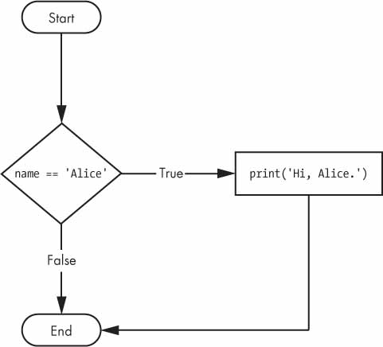
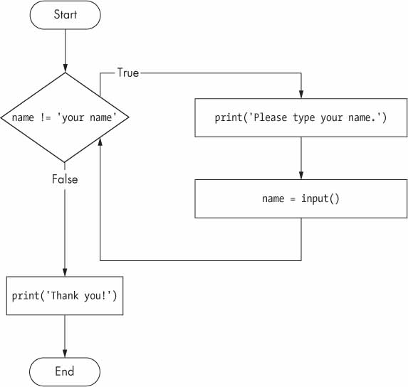

# Controle de Fluxo

- [Controle de Fluxo](#controle-de-fluxo)
  - [Valores Booleanos](#valores-booleanos)
  - [Operadores de comparação](#operadores-de-comparação)
  - [Operadores booleanos](#operadores-booleanos)
    - [Operadores binários booleanos](#operadores-binários-booleanos)
    - [O operador ```not```](#o-operador-not)
  - [Combinando operadores booleanos e de comparação](#combinando-operadores-booleanos-e-de-comparação)
  - [Elementos de controle de fluxo](#elementos-de-controle-de-fluxo)
    - [Condições](#condições)
    - [Blocos de Código](#blocos-de-código)
  - [Execução do Programa](#execução-do-programa)
  - [Declarações de controle de fluxo](#declarações-de-controle-de-fluxo)
    - [Declarações ```if```](#declarações-if)
    - [Declarações ```else```](#declarações-else)
    - [Declarações ```elif```](#declarações-elif)
    - [Declarações do laço ```while```](#declarações-do-laço-while)
      - [Um laço while Irritante](#um-laço-while-irritante)
    - [Declarações break](#declarações-break)


Portanto, você conhece o básico das instruções individuais e que um programa é apenas uma série de instruções. Mas a verdadeira força da programação não é apenas executar uma instrução após a outra, como uma lista de tarefas de fim de semana. Com base na avaliação das expressões, um programa pode decidir pular instruções, repeti-las ou escolher uma das várias instruções para executar. Na verdade, você quase nunca deseja que seus programas comecem na primeira linha de código e simplesmente executem cada linha, direto até o fim. *As instruções de controle de fluxo* podem decidir quais instruções Python executar em quais condições.

Essas instruções de controle de fluxo correspondem diretamente aos símbolos em um fluxograma, portanto, fornecerei versões de fluxograma do código discutido neste capítulo. A **Figura 2-1** mostra um fluxograma sobre o que fazer se estiver chovendo. Siga o caminho feito pelas setas do início ao fim.

  
***Figura 2-1**: Um fluxograma para dizer o que fazer se estiver chovendo*

Em um fluxograma, geralmente há mais de uma maneira de ir do início ao fim. O mesmo é verdadeiro para linhas de código em um programa de computador. Os fluxogramas representam esses pontos de ramificação com diamantes, enquanto as outras etapas são representadas com retângulos. As etapas iniciais e finais são representadas por retângulos com cantos arredondados.

Mas antes de aprender sobre as instruções de controle de fluxo, você primeiro precisa aprender como representar essas opções *sim* e *não* , e precisa entender como escrever esses pontos de ramificação como código Python. Para isso, vamos explorar valores booleanos, operadores de comparação e operadores booleanos.

## Valores Booleanos

Enquanto os tipos de dados inteiro, ponto flutuante e string têm um número ilimitado de valores possíveis, o tipo de dados *Booleano* tem apenas dois valores: ```True``` e ```False```. (Booleano se inicia com maiúsculo porque o tipo de dados tem o nome do matemático George Boole.) Quando inseridos como código Python, os valores booleanos ```True``` e ```False``` não possuem as aspas que você coloca em torno das strings e sempre começam com um *T* ou *F* maiúsculo, com o resto da palavra em minúsculas. Insira o seguinte no shell interativo. (Algumas dessas instruções estão intencionalmente incorretas e farão com que mensagens de erro apareçam.)

```pycon
➊ >>> spam = True
   >>> spam
   True
➋ >>> true
   Traceback (most recent call last):
     File "<pyshell#2>", line 1, in <module>
       true
   NameError: name 'true' is not defined
➌ >>> True = 2 + 2
   SyntaxError: can't assign to keyword
```

Como qualquer outro valor, os valores booleanos são usados em expressões e podem ser armazenados nas variáveis ➊. Se você não usar o caso adequado ➋ ou tentar usar True e False para nomes de variáveis ➌, o Python apresentará uma mensagem de erro.

## Operadores de comparação

Os *operadores de comparação*, também chamados de *operadores relacionais*, comparam dois valores e avaliam até um único valor booleano. A **Tabela 2-1** lista os operadores de comparação.

***Tabela 2-1:** Operadores de comparação*  
| Operador | Significado |
| :-: | :-: |
| == | Igual a |
| != | Diferente de |
| < | Menor que |
| > | Maior que |
| <= | Menos que ou igual a |
| >= | Melhor que ou igual a |

Esses operadores são avaliados como Verdadeiro (```True```) ou Falso (```False```), dependendo dos valores fornecidos a eles. Vamos tentar alguns operadores agora, começando com ```==``` e ```!=```.

```pycon
>>> 42 == 42
True
>>> 42 == 99
False
>>> 2 != 3
True
>>> 2 != 2
False
```

Como você pode esperar, ```==``` (igual a) é avaliado como ```True``` quando os valores em ambos os lados são iguais e ```!=``` (Diferente de) é avaliado como ```True``` quando os dois valores são diferentes.Os operadores ```==``` e ```!=``` podem realmente trabalhar com valores de qualquer tipo de dados.

```pycon
   >>> 'olá' == 'olá'
   True
   >>> 'olá' == 'Olá'
   False
   >>> 'cachorro' != 'gato'
   True
   >>> True == True
   True
   >>> True != False
   True
   >>> 42 == 42.0
   True
➊ >>> 42 == '42'
   False
```

Observe que um valor inteiro ou de ponto flutuante sempre será diferente de um valor de string. A expressão ```42 == '42'``` ➊ é avaliada como ```False``` porque o Python considera o inteiro ```42``` diferente da string ```'42'```.

Os operadores ```<```, ```>```, ```<=``` e ```>=```, por outro lado, funcionam corretamente apenas com valores inteiros e de ponto flutuante.

```pycon
   >>> 42 < 100
   True
   >>> 42 > 100
   False
   >>> 42 < 42
   False
   >>> eggCount = 42
➊ >>> eggCount <= 42
   True
   >>> minhaIdade = 29
➋ >>> minhaIdade >= 10
   True
```

>**A DIFERENÇA ENTRE OS OPERADORES == E =**
>
>Você deve ter notado que o operador ```==``` (igual a) tem dois sinais de igual, enquanto o operador ```=``` (atribuição) tem apenas um sinal de igual. É fácil confundir esses dois operadores um com o outro. Lembre-se apenas destes pontos:
>
>- O operador ```==``` (igual a) pergunta se dois valores são iguais.
>- O operador ```=``` (atribuição) coloca o valor à direita na variável à esquerda.
>
>Para ajudar a lembrar qual é qual, observe que o operador ```==``` (igual a) consiste em dois caracteres, assim como o operador ```!=``` (Diferente de) consiste em dois caracteres.

Você frequentemente usará operadores de comparação para comparar o valor de uma variável com algum outro valor, como nos exemplos ```eggCount <= 42``` ➊ e ```minhaIdade >= 10``` ➋ . (Afinal, em vez de inserir 'cachorro' != 'gato' em seu código, você poderia apenas inserir ```True```.) Você verá mais exemplos disso posteriormente quando aprender sobre as instruções de controle de fluxo.

## Operadores booleanos

Os três operadores booleanos (```and```, ```or```, e ```not```) são usados para comparar valores booleanos. Como os operadores de comparação, eles avaliam essas expressões até um valor booleano. Vamos explorar esses operadores em detalhes, começando com o operador ```and```.

### Operadores binários booleanos

Os operadores ```and``` e ```or``` sempre aceitam dois valores booleanos (ou expressões), portanto, são considerados operadores *binários*. O operador ```and``` avalia uma expressão como ```True``` se *ambos* os valores booleanos forem ```True```; caso contrário, será avaliado como ```False```. Insira algumas expressões usando o ```and``` no shell interativo para vê-lo em ação.

```pycon
>>> True and True
True
>>> True and False
False
```

Uma *tabela verdade* mostra todos os resultados possíveis de um operador booleano. A **Tabela 2-2** é a tabela verdade para o operador ```and```.

***Tabela 2-2:** A tabela verdade do operador ```and```*  
| Expressão | Avalia para...
| :-: | :-:
| True and True | True
| True and False | False
| False and True | False
| False and False | False

Por outro lado, o operador ```or``` avalia uma expressão como ```True``` se *um* dos dois valores booleanos for ```True```. Se ambos forem ```False``` , ele será avaliado como ```False```.

```pycon
>>> False or True
True
>>> False or False
False
```

Você pode ver todos os resultados possíveis do operador ou em sua tabela verdade, mostrada na **Tabela 2-3**.

***Tabela 2-3:** A Tabela Verdade do Operador ```or```*  
| Expressão | Avalia para...
| :-: | :-:
| True or True | True
| True or False | True
| False or True | True
| False or False | False

### O operador ```not```

Ao contrário do ```and``` e do ```or```, o operador ```not``` opera em apenas um valor booleano (ou expressão). Isso o torna um operador *unário*. O operador ```not``` simplesmente avalia o valor booleano oposto.

```pycon
   >>> not True
   False
➊ >>> not not not not True
   True
```

Muito parecido com o uso de negativos duplos na fala e na escrita, você pode aninhar operadores ```not``` ➊, embora nunca não haja nenhuma razão para fazer isso em programas reais. A **Tabela 2-4** mostra a tabela verdade para ```not```.

***Tabela 2-4:** A Tabela Verdade do operador ```not```*  
| Expressão | Avalia para...
| :-: | :-:
| not True | False
| not False | True

## Combinando operadores booleanos e de comparação

Como os operadores de comparação avaliam os valores booleanos, você pode usá-los em expressões com os operadores booleanos.

Lembre-se de que os operadores ```and```, ```or``` e ```not``` são chamados de operadores booleanos porque sempre operam nos valores booleanos ```True``` e ```False```. Embora expressões como ```4 < 5``` não sejam valores booleanos, são expressões avaliadas como valores booleanos. Tente inserir algumas expressões booleanas que usam operadores de comparação no shell interativo.

```pycon
>>> (4 < 5) and (5 < 6)
True
>>> (4 < 5) and (9 < 6)
False
>>> (1 == 2) or (2 == 2)
True
```

O computador avaliará a expressão da esquerda primeiro e, em seguida, avaliará a expressão da direita. Quando conhece o valor booleano de cada um, ele então avaliará toda a expressão até um valor booleano. Você pode pensar no processo de avaliação do computador para (4 < 5) e (5 < 6) como o seguinte:


Você também pode usar vários operadores booleanos em uma expressão, junto com os operadores de comparação:

```pycon
>>> 2 + 2 == 4 and not 2 + 2 == 5 and 2 * 2 == 2 + 2
True
```

Os operadores booleanos têm uma ordem de operações exatamente como os operadores matemáticos. Depois da avaliação de quaisquer operadores matemáticos e de comparação, o Python avalia os operadores ```not``` primeiro, depois os operadores ```and```, e depois os operadores ```or```.

## Elementos de controle de fluxo

As instruções de controle de fluxo geralmente começam com uma parte chamada *condição* e são sempre seguidas por um bloco de código chamado *cláusula* . Antes de aprender sobre as instruções de controle de fluxo específicas do Python, abordarei o que são condição e bloco.

### Condições

As expressões booleanas que você viu até agora podem ser consideradas condições, que são a mesma coisa que expressões; *condição* é apenas um nome mais específico no contexto das instruções de controle de fluxo. As condições sempre são avaliadas como um valor booleano, ```True``` ou ```False```. Uma instrução de controle de fluxo decide o que fazer com base em se sua condição é ```True``` ou ```False```, e quase todas as instruções de controle de fluxo usam uma condição.

### Blocos de Código

Linhas de código Python podem ser agrupadas em *blocos*. Você pode dizer quando um bloco começa e termina a partir do recuo das linhas de código. Existem três regras para bloqueios.

- Os blocos começam quando a indentação aumenta.
- Os blocos podem conter outros blocos.
- Os blocos terminam quando a indentação diminui para zero ou para a indentação de um bloco que o contém.

Os blocos são mais fáceis de entender olhando para algum código recuado, então vamos encontrar os blocos em parte de um pequeno programa de jogo, mostrado aqui:

```py
name = 'Mary'
password = 'swordfish'
if name == 'Mary':
  ➊ print('Olá, Mary')
     if password == 'swordfish':
      ➋ print('Acesso concedido.')
     else:
      ➌ print('Senha incorreta.')
```

Você pode ver a execução deste programa em *<https://autbor.com/blocks/>* . O primeiro bloco de código ➊ começa na linha ```print('Olá, Mary')``` e contém todas as linhas após ele. Dentro deste bloco está outro bloco ➋, que contém apenas uma linha: ```print('Acesso concedido.')```. O terceiro bloco ➌ também tem uma linha: ```print('Senha incorreta.')```.

## Execução do Programa

No programa *```hello.py```* do capítulo anterior, o Python começou a executar instruções na parte superior do programa, descendo uma após a outra. A *execução do programa* (ou simplesmente *execução*) é um termo para a instrução atual sendo executada. Se você imprimir o código-fonte no papel e colocar o dedo em cada linha à medida que é executada, pode pensar no dedo como a execução do programa.

No entanto, nem todos os programas são executados simplesmente descendo. Se você usar o dedo para rastrear um programa com instruções de controle de fluxo, provavelmente se verá pulando o código-fonte com base nas condições e, provavelmente, pulará cláusulas inteiras.

## Declarações de controle de fluxo

Agora, vamos explorar a parte mais importante do controle de fluxo: as próprias instruções. As declarações representam os diamantes que você viu no fluxograma da **Figura 2-1** e são as decisões reais que seus programas tomarão.

### Declarações ```if```

O tipo mais comum de instrução de controle de fluxo é a instrução ```if```. A cláusula de uma instrução ```if``` (ou seja, o bloco após a instrução ```if```) será executada se a condição da instrução for ```True```. A cláusula é ignorada se a condição for ```False``` .

Em português simples, uma instrução if pode ser lida como: “Se esta condição for verdadeira, execute o código da cláusula”. Em Python, uma instrução ```if``` consiste no seguinte:

- A palavra-chave ```if```
- Uma condição (ou seja, uma expressão avaliada como ```True``` ou ```False```)
- Dois pontos
- Começando na próxima linha, um bloco de código recuado (chamado de cláusula ```if```)

Por exemplo, digamos que você tenha algum código que verifica se o nome de alguém é Alice. (Fingir que o nome foi atribuído a algum valor anteriormente.)

```py
if name == 'Alice':
    print('Oi, Alice.')
```

Todas as instruções de controle de fluxo terminam com dois pontos e são seguidas por um novo bloco de código (a cláusula). Esta cláusula da instrução ```if``` é o bloco com ```print('Oi, Alice.')```. **A Figura 2-2** mostra a aparência de um fluxograma desse código.

  
***Figura 2-2**: O fluxograma para uma instrução if*

### Declarações ```else```

Uma cláusula ```if``` pode opcionalmente ser seguida por uma instrução ```else```. A cláusula ```else``` é executada apenas quando a condição da instrução ```if``` é ```False```. Em português simples, uma instrução ```else``` poderia ser lida como, “***Se** esta condição for verdadeira, execute este código. Ou **então**, execute esse código.*” Uma instrução else não tem uma condição e, no código, uma instrução else sempre consiste no seguinte:

- A palavra-chave ```else```
- Dois pontos
- Começando na próxima linha, um bloco de código recuado (chamado de cláusula ```else```)

Voltando ao exemplo de Alice, vamos examinar um código que usa uma instrução ```else``` para oferecer uma saudação diferente se o nome da pessoa não for Alice.

```py
if name == 'Alice':
    print ('Olá, Alice.')
else:
    print ('Olá, estranho.')
```

[A Figura 2-3](https://automatetheboringstuff.com/2e/chapter2/#calibre_link-1539) mostra a aparência de um fluxograma desse código.

  
***Figura 2-3**: O fluxograma para uma instrução else*

### Declarações ```elif```

Embora apenas uma das cláusulas ```if``` ou ```else``` seja executada, você pode ter um caso em que deseja que uma das *muitas* cláusulas possíveis seja executada. A declaração ```elif``` é uma declaração “else if” que sempre segue uma declaração ```if``` ou outra declaração ```elif```. Ele fornece outra condição que é verificada apenas se todas as condições anteriores forem ```False```. No código, uma instrução ```elif``` sempre consiste no seguinte:

- A palavra-chave ```elif```
- Uma condição (ou seja, uma expressão avaliada como ```True``` ou ```False```)
- Dois pontos
- Começando na próxima linha, um bloco de código recuado (chamado de cláusula ```elif```)

Vamos adicionar um elif ao verificador de nomes para ver essa instrução em ação.

```py
if name == 'Alice':
    print('Oi, Alice.')
elif age < 12:
    print('Você não é Alice, criança.')
```

Desta vez, você verifica a idade da pessoa e o programa dirá a ela algo diferente se ela tiver menos de 12 anos. Você pode ver o fluxograma para isso na **Figura 2-4**.

  
*Figura 2-4: O fluxograma para uma declaração elif*

A cláusula ```elif``` é executada se ```age < 12``` for ```True``` e ```name == 'Alice'``` for ```False```. No entanto, se ambas as condições forem ```False```, ambas as cláusulas serão ignoradas. *Não* é garantido que pelo menos uma das cláusulas será executada. Quando há uma cadeia de instruções ```elif```, apenas uma ou nenhuma das cláusulas será executada. Uma vez que uma das condições das declarações seja considerada ```True```, o resto das cláusulas ```elif``` são automaticamente ignoradas. Por exemplo, abra uma nova janela do editor de arquivo e digite o seguinte código, salvando-o como *```vampire.py```* :

```py
nome = 'Carol'
idade = 3000
if nome == 'Alice':
    print('Olá, Alice.')
elif idade < 12:
    print('Você não é Alice, criança.')
elif idade > 2000:
    print('Ao contrário de você, Alice não é uma vampira morta-viva e imortal.')
elif idade > 100:
    print('Você não é Alice, vovó.')
```

Você pode ver a execução deste programa em <https://autbor.com/vampire/>. Aqui, adicionei mais duas declarações ```elif``` para fazer o verificador de nomes saudar uma pessoa com respostas diferentes com base na ```idade```. **A Figura 2-5** mostra o fluxograma para isso.

  
***Figura 2-5**: O fluxograma para várias declarações elif no programa* ```vampire.py```

No entanto, a ordem das declarações ```elif``` importa. Vamos reorganizá-las para introduzir um *bug*. Lembre-se de que o resto das cláusulas ```elif``` são automaticamente ignoradas assim que uma condição ```True``` for encontrada, portanto, se você trocar algumas das cláusulas em *```vampire.py```* , terá um problema. Altere o código para se parecer com o seguinte e salve-o como *```vampire2.py```* :

```py
  nome = 'Carol'
  idade = 3000
  if nome == 'Alice':
      print('Oi, Alice.')
  elif idade <12:
      print('Você não é Alice, criança.')
➊ elif idade > 100:
      print( 'Você não é Alice, vovó.')
  elif idade > 2000:
      print('Ao contrário de você, Alice não é uma vampira morta-viva e imortal.')
```

Você pode ver a execução deste programa em <https://autbor.com/vampire2/>. Digamos que a variável ```idade``` contenha o valor ```3000``` antes que este código seja executado. Você pode esperar que o código imprima a string ```'Ao contrário de você, Alice não é uma vampira morta-viva e imortal.'```. No entanto, como a condição ```idade > 100``` é ```True``` (afinal, 3.000 *é* maior que 100) ➊ , a string ```'Você não é Alice, vovó'.``` é impresso e as declarações ```elif``` seguintes são automaticamente ignoradas. Lembre-se que no máximo apenas uma das cláusulas será executada, e para as declarações ```elif```, a ordem é importante!

**A Figura 2-6** mostra o fluxograma do código anterior. Observe como os losangos para ```idade > 100``` e ```idade > 2.000``` são trocados.

Opcionalmente, você pode ter uma instrução ```else``` após a última instrução ```elif```. Nesse caso, *é* garantido que pelo menos uma (e apenas uma) das cláusulas será executada. Se as condições em cada instrução ```if``` e ```elif``` forem ```False```, a cláusula ```else``` será executada. Por exemplo, vamos recriar o programa Alice para usar as cláusulas ```if```, ```elif``` e ```else```.

```py
name = 'Carol'
age = 3000
if name == 'Alice':
    print('Oi, Alice.')
elif age <12:
    print('Você não é Alice, criança.')
else:
    print('Você não é Alice e nem uma criança.')
```

Você pode ver a execução deste programa em <https://autbor.com/littlekid/>. **A Figura 2-7** mostra o fluxograma desse novo código, que salvaremos como *```littleKid.py```*.

Em linguagem simples, esse tipo de estrutura de controle de fluxo seria “**Se** a primeira condição for verdadeira, faça isso. **Caso contrário**, se a segunda condição for verdadeira, faça isso. **Senão**, faça outra coisa.” Ao usar as instruções ```if```, ```elif``` e ```else``` juntas, lembre-se dessas regras sobre como ordená-las para evitar *bugs* como o da **Figura 2-6**. Primeiro, sempre há exatamente uma instrução ```if```. Quaisquer instruções ```elif``` de que você precisa devem seguir a instrução ```if```. Em segundo lugar, se você quiser ter certeza de que pelo menos uma cláusula seja executada, feche a estrutura com uma instrução ```else```.

  
***Figura 2-6**: O fluxograma do programa* ```vampire2.py```*. O caminho X logicamente nunca acontecerá, porque se a idade fosse maior que 2.000, já teria sido maior que 100.*

  
***Figura 2-7**: Fluxograma do programa* ```littleKid.py``` *anterior*

### Declarações do laço ```while```

Você pode fazer um bloco de código ser executado repetidamente usando uma instrução ```while```. O código em uma cláusula ```while``` será executado enquanto a condição da instrução ```while``` for ```True```. No código, uma instrução ```while``` sempre consiste no seguinte:

- A palavra-chave ```while```
- Uma condição (ou seja, uma expressão avaliada como ```True``` ou ```False```)
- Dois pontos
- Começando na próxima linha, um bloco de código recuado (chamado de cláusula ```while```)

Você pode ver que uma instrução ```while``` é semelhante a uma instrução ```if```. A diferença está em como eles se comportam. No final de uma cláusula ```if```, a execução do programa continua após a sua instrução. Mas no final de uma cláusula ```while```, a execução do programa volta para o início dessa instrução. A cláusula ```while``` é frequentemente chamada de *laço while* ou apenas *laço*.

Vamos olhar uma declaração ```if``` e um laço ```while``` que usam a mesma condição e tomam as mesmas ações com base nessa condição. Aqui está o código com uma instrução ```if```:

```py
spam = 0
if spam < 5:
    print('Olá, mundo.')
    spam = spam + 1
```

Aqui está o código com uma instrução ```while```:

```py
spam = 0
while spam < 5:
    print ('Olá, mundo.')
    spam = spam + 1
```

Essas declarações são semelhantes - tanto ```if``` quanto o ```while``` verificam o valor de ```spam```, e se for menor que ```5```, eles imprimem uma mensagem. Mas quando você executa esses dois trechos de código, algo muito diferente acontece para cada um. Para a instrução ```if```, a saída é simplesmente ```"Olá, mundo".```. Mas para a declaração ```while``` será ```"Olá, mundo".``` repetido cinco vezes! Dê uma olhada nos fluxogramas dessas duas partes do código, **Figuras 2-8** e **2-9**, para ver por que isso acontece.

  
***Figura 2-8**: O fluxograma para o código da instrução ```if```*

  
***Figura 2-9**: O fluxograma para o código da instrução ```while```*

O código com a instrução ```if``` verifica a condição e imprime ```Olá, mundo.``` apenas uma vez se essa condição for verdadeira. O código com o laço ```while```, por outro lado, irá imprimi-lo cinco vezes. O laço para após cinco impressões porque o número inteiro no ```spam``` aumenta em um no final de cada iteração do laço, o que significa que o laço será executado cinco vezes antes que o ```spam < 5``` seja ```False```.

No laço ```while```, a condição é sempre verificada no início de cada *iteração* (ou seja, cada vez que o laço é executado). Se a condição for ```True```, a cláusula é executada e, posteriormente, a condição é verificada novamente. Na primeira vez que a condição for considerada ```False```, a cláusula ```while``` é ignorada.

#### Um laço while Irritante

Aqui está um pequeno programa de exemplo que premanecerá pedindo que você digite, literalmente, ```seu nome```. Selecione **Arquivo** ▸ **Novo** para abrir uma nova janela do editor de arquivo, insira o seguinte código e salve o arquivo como *```seuNome.py```*:

```py
➊ nome = ''
➋ while nome! = 'seu nome.':
    print ('Por favor, digite seu nome.')
  ➌ nome = input ()
➍ print ('Obrigado!')
```

Você pode ver a execução deste programa em <https://autbor.com/yourname/>. Primeiro, o programa define a variável ```nome``` ➊ como uma string vazia. É assim que a condição ```nome != 'seu nome.'``` será avaliada como ```True``` e a execução do programa vai entrar na cláusula de laço ```while``` ➋ .

O código dentro desta cláusula pede ao usuário para digitar ```seu nome```, que é atribuído à variável ```nome``` ➌. Uma vez que esta é a última linha do bloco, a execução se move de volta para o início do laço ```while``` e reavalia a condição. Se o valor em nome *não* for *igual* à string '```seu nome```' , então a condição é ```True``` e a execução insere a cláusula ```while``` novamente.

Mas, uma vez que o usuário digita ```seu nome```, a condição do laço ```while``` será ```nome != 'Seu nome.'```, que avalia como ```False```. A condição é agora falsa, e em vez da execução do programa entrar novamente na cláusula de laço ```while```, o Python pula o laço e continua executando o restante do programa ➍. **A Figura 2-10** mostra um fluxograma para o programa *```yourName.py```* .

  
***Figura 2-10**: Um fluxograma do programa* ```yourName.py```

Agora, vamos ver *```yourName.py```* em ação. Pressione **F5** para executá-lo e insira algo diferente do seu nome algumas vezes antes de dar ao programa o que ele deseja.

```py
Por favor, digite seu nome.
Al
Por favor, digite seu nome.
Albert
Por favor, digite seu nome.
% @ % * (^ & !!!
Por favor, digite seu nome.
seu nome.
obrigado!
```

Se você nunca digitar ```seu nome```, então a condição do laço ```while``` nunca será ```False```, e o programa permanecerá perguntando para sempre. Aqui, a chamada ```input()``` permite que o usuário insira a string certa para fazer o programa seguir em frente. Em outros programas, a condição pode nunca mudar de fato, e isso pode ser um problema. Vamos olhar como você pode sair de um laço ```while```.

### Declarações break

Há um atalho para obter a saída de execução de uma cláusula de laço ```while``` precocemente. Se a execução atingir uma declaração ```break```, ele imediatamente sai da cláusula de laço ```while```. No código, uma instrução ```break``` simplesmente contém a palavra-chave ```break```.

Muito simples, certo? Aqui está um programa que faz a mesma coisa que o programa anterior, mas usa uma instrução ```break``` para escapar do laço. Insira o seguinte código e salve o arquivo como *```yourName2.py```* :

```py
➊ while True:
    print ('Digite seu nome.')
  ➋ name = input ()
  ➌ if name == 'your name':
    ➍ break➎
print ('Obrigado!')
```

Você pode ver a execução deste programa em <https://autbor.com/yourname2/>. A primeira linha ➊ cria um *laço infinito*; é um laço ```while``` cuja condição é sempre ```True```. (A expressão ```True```, afinal, sempre é avaliada com o valor ```True```.) Depois que a execução do programa entra nesse laço, ele sairá do laço apenas quando uma instrução ```break``` for executada. (Um laço infinito que *nunca* sai é um *bug* comum de programação.)

Tal como antes, este programa pede ao utilizador para introduzir o ```seu nome``` ➋. Agora, no entanto, enquanto a execução ainda está dentro do laço ```while```, uma instrução ```if``` ➌ verifica se ```nome``` é igual a ```'seu nome'```. Se esta condição for verdadeira, a instrução ```break``` é executada ➍, e a execução sai do laço para ```print('Obrigado!')``` ➎. Caso contrário, a cláusula da instrução ```if``` que contém a instrução ```break``` é ignorada, o que coloca a execução no final do laço ```while```. Neste ponto, a execução do programa salta de volta para o início da instrução ```while``` ➊ para verificar novamente a condição. Uma vez que esta condição é meramente o valor Booleano ```True```, a execução entra no laço para pedir ao usuário para digitar seu nome novamente. Consulte a **Figura 2-11** para ver o fluxograma deste programa.

Execute *```yourName2.py```* e insira o mesmo texto inserido para *```yourName.py```*. O programa reescrito deve responder da mesma forma que o original.

  
***Figura 2-11**: O fluxograma para o programa* ```yourName2.py``` *com um laço infinito. Observe que o caminho X logicamente nunca acontecerá, porque a condição de laço é sempre ```True```.*
