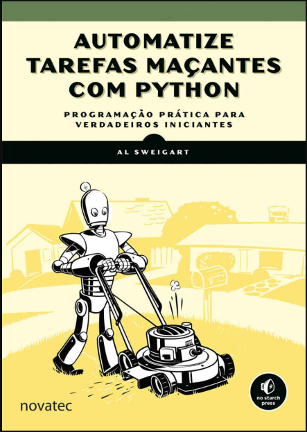
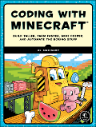
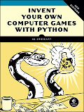
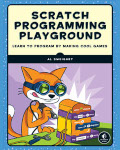
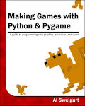

# Automatize Tarefas Maçantes com Python - 2ª edição

Por *Al Sweigart*. Gratuito para leitura sob uma licença [Creative Commons](https://creativecommons.org/licenses/by-nc-sa/3.0/).  
Traduzido de [automatetheboringstuff.com](https://automatetheboringstuff.com/)

- [Automatize Tarefas Maçantes com Python - 2ª edição](#automatize-tarefas-maçantes-com-python---2ª-edição)
  - [Programação prática para iniciantes](#programação-prática-para-iniciantes)
  - [Índice](#índice)
  - [Sobre o Autor](#sobre-o-autor)

>"*A melhor parte da programação é o triunfo de ver a máquina fazer algo útil. Automatizar as coisas chatas com Python enquadra toda a programação como esses pequenos triunfos; isso torna o chato divertido*".  
>[Hilary Mason](https://twitter.com/hmason), fundadora do [Fast Forward Labs](http://www.fastforwardlabs.com/) e cientista de dados em residência na [Accel](http://www.accel.com/).

>"*Estou me divertindo muito quebrando coisas e depois juntando-as novamente, e apenas me lembrando da alegria de transformar um conjunto de instruções em algo útil e divertido, como fiz quando criança.*"  
>[Wil Wheaton](https://twitter.com/wilw), [WIL WHEATON dot NET](http://wilwheaton.net/2015/09/hello-world/)

## Programação prática para iniciantes

Se você já passou horas renomeando arquivos ou atualizando centenas de células da planilha, sabe como essas tarefas podem ser tediosas. Mas, e se você pudesse ter seu computador fazendo isso por você?

Em **Automatize as coisas maçantes com o Python**, você aprenderá como usar o Python para escrever programas que fazem em minutos o que levaria horas para você fazer manualmente, sem a necessidade de experiência prévia em programação. Depois de dominar o básico da programação, você criará programas Python que executam, sem esforço, proezas úteis e impressionantes de automação para:

- Pesquisar texto em um ou em vários arquivos;
- Criar, atualizar, mover e renomear arquivos e pastas;
- Pesquisar na Web e baixar conteúdo online;
- Atualizar e formatar dados em planilhas do Excel de qualquer tamanho;
- Dividir, mesclar, inserir marca d'água e criptografar PDFs;
- Enviar e-mails de lembrete e notificações de texto;
- Preencher formulários on-line.

As instruções passo a passo orientarão você em cada programa e os projetos práticos no final de cada capítulo desafiarão você a melhorar esses programas e a usar suas novas habilidades para automatizar tarefas semelhantes.

Não gaste seu tempo fazendo o trabalho que um macaco bem treinado poderia fazer. Mesmo que você nunca tenha escrito uma linha de código, você pode fazer com que seu computador faça o trabalho pesado. Aprenda como neste livro.

## Índice

- [Capítulo 0 – Introdução](00-Introducao.md)
- [Capítulo 1 – Python Basics](01-Fundamentos_de_Python.md)
- Capítulo 2 – Flow Control
- Capítulo 3 – Functions
- Capítulo 4 – Lists
- Capítulo 5 – Dictionaries and Structuring Data
- Capítulo 6 – Manipulating Strings
- Capítulo 7 – Pattern Matching with Regular Expressions
- Capítulo 8 – Input Validation
- Capítulo 9 – Reading and Writing Files
- Capítulo 10 – Organizing Files
- Capítulo 11 – Debugging
- Capítulo 12 – Varredura na Web
- Capítulo 13 – Working with Excel Spreadsheets
- Capítulo 14 – Working with Google Spreadsheets
- Capítulo 15 – Working with PDF and Word Documents
- Capítulo 16 – Working with CSV Files and JSON Data
- Capítulo 17 – Keeping Time, Scheduling Tasks, and Launching Programs
- Capítulo 18 – Sending Email and Text Messages
- Capítulo 19 – Manipulating Images
- Capítulo 20 – Controlling the Keyboard and Mouse with GUI Automation
- Apêndice A – Installing Third-Party Modules
- Apêndice B – Running Programs
- Apêndice C – Answers to the Practice Questions

## Sobre o Autor

Al Sweigart é desenvolvedor de software e ensina programação para crianças e adultos. Ele escreveu vários livros para iniciantes, incluindo
[Scratch Programming Playground](https://www.nostarch.com/scratchplayground),
[Cracking Codes with Python](https://inventwithpython.com/cracking/),
[Invent Your Own Computer Games with Python](https://inventwithpython.com/), e
[Making Games with Python & Pygame](https://inventwithpython.com/pygame/).

[//]: # (Rodapé)

---

Apoie o autor comprando o pacote de impressão / e-book da [No Starch Press](https://www.nostarch.com/automatestuff) ou separadamente na [Amazon](http://www.amazon.com/gp/product/1593275994/ref=as_li_tl?ie=UTF8&camp=1789&creative=9325&creativeASIN=1593275994&linkCode=as2&tag=playwithpyth-20&linkId=HDM7V3T6RHC5VVN4).

Leia os outros livros em Python licenciados em Creative Commons.

    
