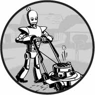

# Introdução

"*Você acabou de fazer em duas horas o que três de nós levamos dois dias para fazer.*" Meu colega de quarto da faculdade estava trabalhando em uma loja de eletrônicos no início dos anos 2000. Ocasionalmente, a loja recebia uma planilha com milhares de preços de produtos de outras lojas. Uma equipe de três funcionários imprimia a planilha em uma pilha grossa de papel e a dividia entre si. Para cada preço de produto, eles procuravam o preço de sua loja e anotavam todos os produtos que seus concorrentes vendiam por menos. Geralmente levava alguns dias.

“*Sabe, eu poderia escrever um programa para fazer isso, se você tiver o arquivo original das impressões*", disse meu colega de quarto, quando os viu sentados no chão com papéis espalhados e empilhados ao redor.

Depois de algumas horas, ele mostrou um pequeno programa que leu o preço de um concorrente em um arquivo, encontrou o produto no banco de dados da loja e observou se o concorrente era mais barato. Ele ainda era novo em programação, por isso passava a maior parte do tempo pesquisando documentação em um livro de programação. O programa real levou apenas alguns segundos para ser executado. Meu colega de quarto e seus colegas de trabalho tiveram uma loga hora de almoço naquele dia.

Este é o poder da programação de computadores. Um computador é como um canivete suíço que você pode configurar para inúmeras tarefas. Muitas pessoas passam horas clicando e digitando para executar tarefas repetitivas, sem saber que a máquina que estão usando pode fazer seu trabalho em segundos, se derem as instruções corretas.

## Para quem é este livro?

O software está no centro de muitas das ferramentas que usamos hoje: quase todo mundo usa redes sociais para se comunicar, muitas pessoas têm computadores conectados à Internet em seus telefones e a maioria dos trabalhos de escritório envolve a interação com um computador para realizar o trabalho. Como resultado, a demanda por pessoas que podem codificar disparou. Inúmeros livros, tutoriais interativos na Web e campos de treinamento para desenvolvedores prometem transformar iniciantes ambiciosos em engenheiros de software com salários de seis dígitos.

Este livro não é para essas pessoas. É para todo mundo.

Por si só, este livro não o tornará um desenvolvedor de software profissional, assim como algumas aulas de guitarra o transformarão em uma estrela do rock. Mas se você trabalha em escritório, é administrador, acadêmico ou qualquer outra pessoa que usa um computador para trabalhar ou se divertir, aprenderá o básico da programação para poder automatizar tarefas simples como estas:

* Mover e renomear milhares de arquivos e classificá-los em pastas;
* Preencher formulários on-line - sem precisar digitar;
* Baixar arquivos ou copiar o texto de um site sempre que ele é atualizado;
* Receber mensagens de texto personalizadas do seu computador;
* Atualizar ou formatar planilhas do Excel;
* Verificar seu email e enviar respostas pré-escritas.

Essas tarefas são simples, mas os seres humanos gastam tempo fazendo-as, e geralmente são tão triviais ou específicas que não há software pronto para realizá-las. Armado com um pouco de conhecimento de programação, no entanto, você pode fazer com que seu computador execute essas tarefas por você.
